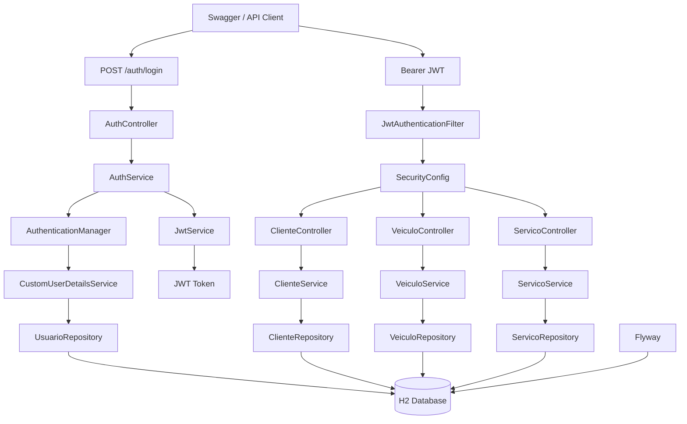

# Arquitetura da Solução — Software Mavericks

## Visão geral

A aplicação utiliza uma arquitetura em camadas, separando autenticação, controle de acesso, regras de negócio, persistência e banco de dados.

## Responsabilidades dos componentes

- **AuthController:** disponibiliza o endpoint de login.
- **AuthService:** realiza a autenticação e solicita a geração do JWT.
- **JwtService:** gera e valida os tokens JWT.
- **JwtAuthenticationFilter:** intercepta requisições protegidas e valida o token enviado no header `Authorization`.
- **SecurityConfig:** define autenticação, autorização e permissões dos perfis `USER` e `ADMIN`.
- **Controllers:** recebem as requisições HTTP e direcionam as operações para os serviços.
- **Services:** concentram as regras de negócio.
- **Repositories:** realizam o acesso aos dados utilizando Spring Data JPA.
- **H2 Database:** banco de dados utilizado pela aplicação.
- **Flyway:** controla as versões e migrações do banco de dados.

## Fluxo de autenticação

1. O cliente envia usuário e senha para `POST /auth/login`.
2. O `AuthController` encaminha os dados para o `AuthService`.
3. O Spring Security autentica o usuário.
4. O `JwtService` gera um token JWT.
5. O cliente utiliza o token nas próximas requisições através do header `Authorization: Bearer <token>`.
6. O `JwtAuthenticationFilter` valida o token.
7. O `SecurityConfig` verifica as permissões do usuário.
8. A requisição é encaminhada para o Controller correspondente.

## Perfis de acesso

| Perfil | GET | POST | PUT | DELETE |
|---|---|---|---|---|
| USER | Permitido | Negado | Negado | Negado |
| ADMIN | Permitido | Permitido | Permitido | Permitido |